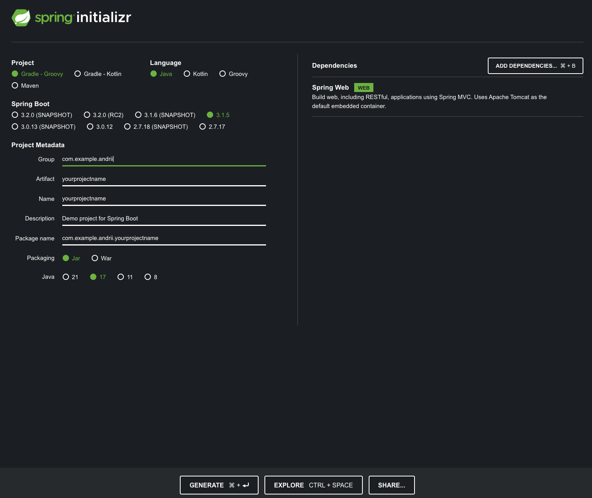
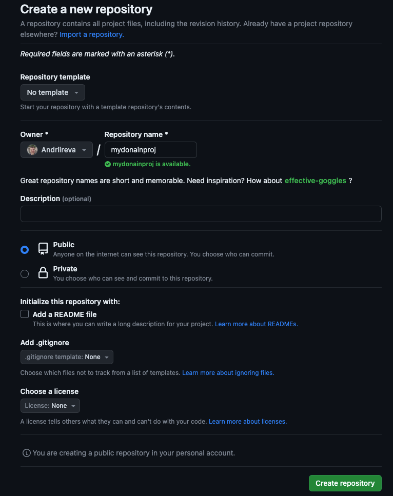
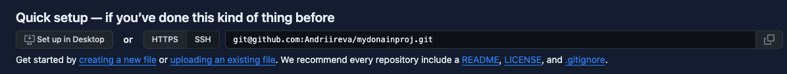

# Create new project

### Create new spring project
1. Open https://start.spring.io/ 
2. Set Artifact name according to your domain
3. Add dependency Spring Web
4. Let other fields as default. See example how spring initialzr should looks like:
   
5. Press generate and download zip archive for you project
6. Unpack it to folder

### Install Git client
1. Recommended git terminal https://git-scm.com/downloads
2. Open git bash

### Setup project in github
#### Setup account in github
1. Open github https://github.com/
2. Register account (if you dont have it)
3. Click on you profile on top right -> settings -> SSH and GPG keys. Click New SSH Key
4. Open git bash. Generate new keys according to [generate new ssh](https://docs.github.com/en/authentication/connecting-to-github-with-ssh/generating-a-new-ssh-key-and-adding-it-to-the-ssh-agent)
5. Command to generate should look like. Replace email on email you used for github
   `ssh-keygen -t ed25519 -C "your_email@example.com"`
6. 2 pairs of key should be generated at path `/Users/YOU/.ssh/`
7. Open file with pub extension copy it to clipboard. 
8. Go back to github and paste key to Key field. Put any value to Title as you want. CLick Add SSH key

#### Register new project
1. Create new project by clicking "new" button
2. Fill Repository name according to your domain. Leave "add .gitignore" as none
  
3. Don't leave this page for now. You will need copy ssh link.

### Upload your spring project to github
1. Open gitbash terminal at folder where you unpacked your project.
2. Execute a sequence of command
3. `git init`
4. `git add .`
5. `git config user.name "yorname.lastname"` replace as your name
6. `git config user.email "your@email.com"` replace to your email
7. `git commit -m "first commit"`
8. `git branch -M main`
9. `git remote add origin git@github.com:youraccountname/yourprojectname.git` copy ssh url and replace it

10. `git push -u origin main`
11. After that steps you should have your project on gitgub

# Getting Started with spring boot

### Reference Documentation
For further reference, please consider the following sections:

* [Official Gradle documentation](https://docs.gradle.org)
* [Spring Boot Gradle Plugin Reference Guide](https://docs.spring.io/spring-boot/docs/3.1.5/gradle-plugin/reference/html/)
* [Create an OCI image](https://docs.spring.io/spring-boot/docs/3.1.5/gradle-plugin/reference/html/#build-image)
* [Spring Web](https://docs.spring.io/spring-boot/docs/3.1.5/reference/htmlsingle/index.html#web)

### Guides
The following guides illustrate how to use some features concretely:

* [Building a RESTful Web Service](https://spring.io/guides/gs/rest-service/)
* [Serving Web Content with Spring MVC](https://spring.io/guides/gs/serving-web-content/)
* [Building REST services with Spring](https://spring.io/guides/tutorials/rest/)

### Additional Links
These additional references should also help you:

* [Gradle Build Scans – insights for your project's build](https://scans.gradle.com#gradle)